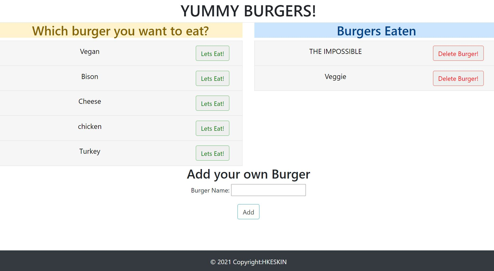

# burgerHandleBars

## Description

This appis a burger logger with MySQL, Node, Express, Handlebars and an ORM
* Yummy Burgers! is a restaurant app that lets users input the names of burgers they'd like to eat.

* Whenever a user submits a burger's name, app will display the burger on the left side of the page -- Ready to eat!

* Each burger in the waiting area also has a `Lets eat!` button. When the user clicks it, the burger will move to the right side of the page.

* App will store every burger in a database, whether devoured or not.

* Below is an example of the application screenshot


## Directory structure

```
.
├── config
│   ├── connection.js
│   └── orm.js
│ 
├── controllers
│   └── burgers_controller.js
│
├── db
│   ├── schema.sql
│   └── seeds.sql
│
├── models
│   └── burger.js
│ 
├── node_modules
│ 
├── package.json
│
├── public
│   └── assets
│       ├── css
│       │   └── burger_style.css
│       │   js
│       │   └── burgers.js
│       └── img
│   
│
├── server.js
│
└── views
    ├── index.handlebars
    └── layouts
        └── main.handlebars
    └── partials
        └──burgers
           └── burger-block.handlebars
```
## Table of Contents

* Title

* Description

* Directory structure

* Table of Contents

* Installation

* Usage

* Questions

* Urls


## Installation

```md
npm init
npm install 
```

## Usage

```md
node server.js
```


## Questions
Contact with me with any questions : [GitHub](https://github.com/kinziva)<br />

## Urls
* Repository [Repository URL ](https://github.com/kinziva/burgerHandleBars)
* Heroku [Repository URL ](https://github.com/kinziva/burgerHandleBars)

## delete when done

### Read This

When trying to connect remotely to your Heroku database on an open network such as a coffee shop, library, or even your University WiFi, it will be blocked. If you are experiencing a Heroku connection error, this could be why.

### Important

* **This assignment must be deployed.** Be sure to utilize the [MYSQL Heroku Deployment Guide](../../04-Important/MySQLHerokuDeploymentProcess.pdf) in order to deploy your assignment.

* App will store every burger in a database, whether devoured or not.

* [Check out this video of the app for a run-through of how it works](https://youtu.be/msvdn95x9OM).


### Submission on BCS

* **This assignment must be deployed.** * Please submit both the deployed Heroku link to your homework AND the link to the Github Repository!


4. Run the `schema.sql` and `seeds.sql` files into the mysql server from the command line

5. Now you're going to run these SQL files.

   * Make sure you're in the `db` folder of your app.

   * Start MySQL command line tool and login: `mysql -u root -p`.

   * With the `mysql>` command line tool running, enter the command `source schema.sql`. This will run your schema file and all of the queries in it -- in other words, you'll be creating your database.

   * Now insert the entries you defined in `seeds.sql` by running the file: `source seeds.sql`.

   * Close out of the MySQL command line tool: `exit`.

### Hosting on Heroku

Now that we have a backend to our applications, we use Heroku for hosting. Please note that while **Heroku is free**, it will request credit card information if you have more than 5 applications at a time or are adding a database.

Please see [Heroku’s Account Verification Information](https://devcenter.heroku.com/articles/account-verification) for more details.

- - -

### Add To Your Portfolio

After completing the homework please add the piece to your portfolio. Make sure to add a link to your updated portfolio in the comments section of your homework so the TAs can easily ensure you completed this step when they are grading the assignment. To receive an 'A' on any assignment, you must link to it from your portfolio.

- - -
### Reminder

When trying to connect remotely to your Heroku database on an open network such as a coffee shop, library, or even your University WiFi, it will be blocked. If you are experiencing a Heroku connection error, this could be why.

